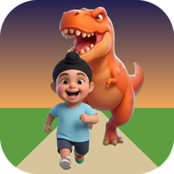

<div align="center">


# Sukhi's Run

**Sukhi runs. Something chases him. Getting caught is the fun part.**

For children of about four. No reading, no losing, nothing to buy.
</div>

---

> **An experiment.** It is on the website at
> [sukhiplay.com/playground/run](https://sukhiplay.com/playground/run/)
> and not inside Sukhi Play. It stays out here, where children can play with
> it and it can change freely, until it is clearly something they come back
> to. Then it gets a release.

A chase game for the little brother, in the spirit of the running games older
children play. Sukhi runs down a jungle path or a swamp boardwalk at night,
and something is after him: a gorilla, a bear, a bog monster, a crocodile, a
T-Rex, a raptor, a mummy, Pumpkin Jack, or Long-Legs, a tall creature made of
branches. When it catches him, it does something silly, and he goes again.

## What he does

| | |
| --- | --- |
| **Pick who chases** | A row of faces. Tap one, or press the big button for a surprise. |
| **Steer** | Three lanes and four moves: left, right, hop and duck. Swipe, use the arrow keys, or press the big buttons; a tap on the path is a hop. The button he needs lights up as something comes. |
| **Coins and helpers** | Coins in the lanes, and now and then a helper: a magnet that pulls the coins in, a bubble that takes one bump for him, spring shoes that hop over anything, and a jar of fireflies that lights the night and holds the chaser back. |
| **Bumps** | A bump makes him stumble, and the chaser comes up close behind. Run clean and it drops back. A second bump while it is still close, and he is caught. |
| **Caught** | Each one catches him its own way: the gorilla swings him onto its shoulders, the bear hugs him, the bog monster burps him out green, the crocodile tickles him, the T-Rex sneezes him into the leaves, the raptor runs off with his shoe, the mummy wraps him up like a present, Pumpkin Jack's crows land on him, and Long-Legs rocks him in a hammock. Then one big button to go again. |

It speeds up gently over two minutes and never beyond what a small child can
follow. A hop or duck pressed a little early, as the button lights up, still
gets him over or under.

## How scary

A grown-up choice, behind a press and hold on the button in the corner:

| | |
| --- | --- |
| **Silly** | The gorilla, the bear and the bog monster, in daylight, a little slower. |
| **Spooky** (the start) | Adds the dinosaurs, the crocodile, the mummy and Pumpkin Jack, and the swamp at night. |
| **Scary** | Adds Long-Legs. |

## Built the same way as the others

- **Offline and private.** Nothing is fetched from anywhere else and nothing is
  collected. The only thing kept is the scary setting and whether the sound is
  on, in this browser's storage. There are no scores to keep.
- **No text a child needs.** Every control is a picture, at least 64px, and
  reachable by touch, mouse and keyboard.
- **Keyboard.** Arrows or W A S D to steer, hop and duck; Space hops; Escape
  pauses.
- **Drawn in a canvas.** The path is drawn in perspective and everything on it
  is a picture standing up, so it runs on an old tablet. Every sound is
  synthesised, so there are no audio files.

## Building it

```
npm install
npm run dev      # http://localhost:5181
npm run build    # into dist/
```

Plain TypeScript and Vite, no framework, no runtime dependencies.

The pictures start as sheets, which are not in this repository.
`scripts/cut-sheet.py` cuts a sheet on a plain background into separate
transparent pictures; `scripts/faces.py` crops the round faces;
`scripts/scenes.py` makes the backdrops; and `scripts/build-icons.py` the
icons.

## Licence

The code is under the [Sukhi Play Personal Use Licence 1.0](LICENSE): free for
individuals and families, never for commercial use.

**The pictures are not covered by the code's licence.** Sukhi's are a likeness
of a real child. Everything in `src/assets/` and the icons in `public/` is
© Mandeep Singh, all rights reserved, and may not be reused, modified or
redistributed.
